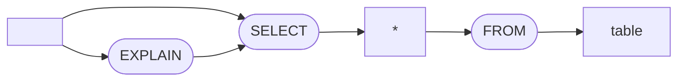
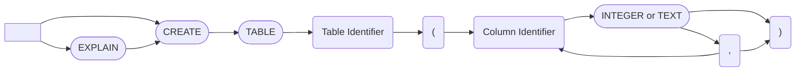
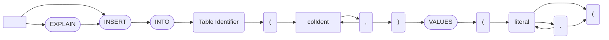

# CDB
cdb is a database built for learning about the inner workings of databases. cdb was heavily inspired by SQLite, Cockroach database, and the CMU database lectures. cdb implments a subset of SQL described below.

## Language reference

### Special tables
`cdb_schema` which holds the database schema.

### SELECT

### CREATE

### INSERT

