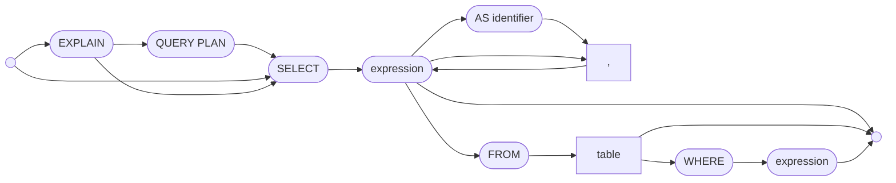
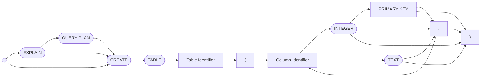
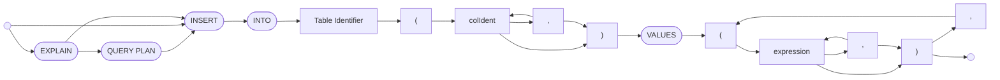
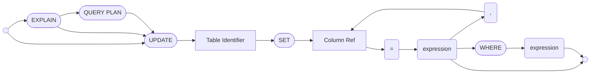
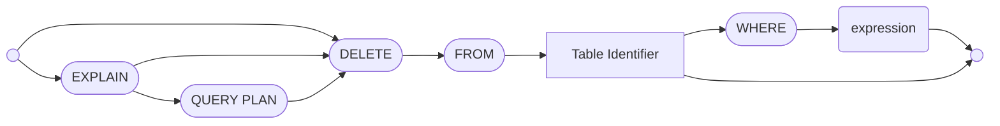
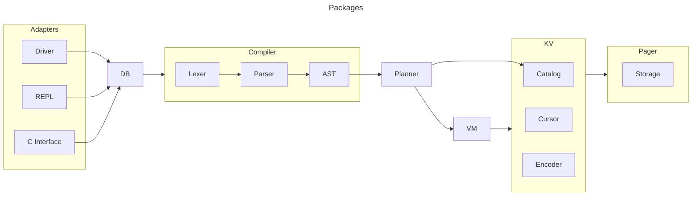

# CDB
CDB is a SQL database built for learning about the inner workings of databases. CDB
was heavily inspired by [SQLite](https://www.sqlite.org/),
[CockroachDB](https://github.com/cockroachdb/cockroach), and the
[CMU Database Group](https://www.youtube.com/c/cmudatabasegroup).

## Running CDB
There are several ways to download or run CDB
1. Download the appropriate executable from the releases to run the database
through the REPL.
2. Use with the go driver found in the `driver` package.
3. The JDBC can be found at https://github.com/chirst/cdb-jdbc
4. Run with a c library from the releases page.

## Language reference
CDB implements a subset of SQL described below.

### System tables
`cdb_schema` holds the database schema. This table can be queried to understand
your schema.

### Indexes
Note indexes on primary keys are supported. See `EXPLAIN QUERY PLAN` for
details. Or `EXPLAIN` for more details.

### SELECT

### CREATE
Create supports the `PRIMARY KEY` column constraint for a single integer column.

### INSERT

### UPDATE

### DELETE

## Flags
Run `cdb -h` for command line flags.

## Architecture

### REPL (Read Eval Print Loop)
The REPL works with the DB (Database) layer and is responsible for two things.
Passing down the SQL strings that are read by the REPL to the DB. Printing out
execution results that are returned from the DB layer. The REPL can be thought
of as an adapter layer.

### Driver
The Driver plays the same role as the REPL in that it adapts the DB to be used
in a Go program. This is done by implementing the Go standard library
`database/sql/driver.Driver` interface.

### C Interface
The C Interface is special in that it enables the database to be used from
almost any language. It is used to make the JDBC driver work. Found here
https://github.com/chirst/cdb-jdbc

### DB (Database)
The DB (Database) layer is an interface that is called by adapters think of this
as the place where the the database connects with the outside world.

### Compiler
The Compiler is responsible for converting a raw SQL string to a AST (Abstract
syntax tree). In doing this, the compiler performs two major steps known as
lexing and parsing.

### Planner
The Planner is what is known as a query planner. The planner takes the AST
generated by the compiler and performs steps to generate an optimal "byte code"
routine consisting of commands defined in the VM. This routine can be examined
by prefixing any SQL statement with the `EXPLAIN` keyword.

### VM (Virtual Machine)
The VM defines a set of commands that can be executed or explained. Each command
performs basic calls into the KV layer that make up a query execution. This
mechanism makes queries predictable and consistent.

### KV (Key Value)
The KV layer implements a data structure known as a
[B+ tree](https://en.wikipedia.org/wiki/B%2B_tree) this tree enables the
database to perform fast lookups. At this layer, data is encoded into byte
slices by the `Encoder`. The KV layer implements a cursor abstraction, which
enables queries to scan and seek the B trees associated with a
table or index. Additionally this layer maintains the `Catalog`, an in memory
representation of the database schema.

### Pager
The Pager sits on top of a contiguous block of bytes defined in the `Storage`
interface. This block is typically a single file enabling the database to
persist data, but it can be an in memory representation. The pager abstracts
this block into pages which represent nodes in the KV layer's B tree. The pager
is capable of caching the pages. The pager implements a read write mutex for
concurrency control. The pager implements atomic writes to its storage through
what is known as the journal file.
